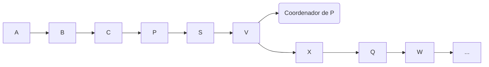

<div>
    
    <p> 
        Universidade Federal de Ouro Preto
        <br>
        Disciplina: BCC362 - Sistemas Distribuidos
        <br>
        Professor: Carlos Frederico
    </p>
</div>
<hr />

# Trabalho Pratico I

<details>

## Testando o Dockerfile:

``` bash

vagrant up
vagrant ssh

```

- Dentro do ambiente vagrant:

``` bash

docker run -it myimage:1.0 /bin/sh
ls

```

## Criando diretamente no Host:

``` bash

docker build -t <NOME_DA_IMAGEM>:<VERSAO> --build-arg NAME=<NOME> --build-arg CLASS=<TURMA> .
docker run -it <NOME_DA_IMAGEM>:<VERSAO> /bin/sh

```
## Subindo num Registry:

- Lembre-se de criar o repositorio no DockerHub

### Pipeline:

``` bash

name: Docker Image CI

on:
  push:
    branches: [ "main" ]
  pull_request:
    branches: [ "main" ]

jobs:

  build-and-deploy:

    runs-on: ubuntu-latest

    steps:
    - uses: actions/checkout@v2
    - name: Login Docker Hub
      run: echo '${{ secrets.DOCKER_PASSWORD }}' | docker login -u "${{ secrets.DOCKER_USERNAME }}" --password-stdin
    - name: Build and tag the Docker image
      run: docker build . --file tpi/Dockerfile --tag "${{ secrets.IMAGE_NAME }}":1.0 --build-arg NAME=<NAME> --build-arg CLASS=<CLASS> 
    - name: Push the Docker image to Docker Hub
      run: docker push "${{ secrets.IMAGE_NAME }}":1.0
    - name: Logout from Docker Hub
      run: docker logout

```

### Diretamente:

``` bash

    echo '<PASSWORD>' | docker login -u "<USERNAME>" --password-stdin
    docker build . --file tpi/Dockerfile --tag <IMAGE_NAME>:<VERSAO> --build-arg NAME=<NAME> --build-arg CLASS=<CLASS> 
    docker push <REGISTRY/REPOSITORIE>:<VERSION>
    docker logout

```

</details>

<hr/>

# Trabalho Pratico II

## Enunciado

- Discorra e apresente os conceitos de eleições
de processos apresentados em aula:
  - Problema em pauta:
    - Objetivos
    - Suposições/hipotes
  - Abordagens:
    - Algoritmo do valentão
    - Algoritmo do anel
    - Eleição em ambiente sem fio
    - Eleição em rede ad hoc sem fio
    - Eleição em sistemas de grande escala
    - Aborde um novo exemplo
  - Demonstre uma implementação de um dos algoritmos abordados
- Discorra e apresente os conceitos e abordagens do Rabbitmq

## Eleições de Processos

### Introdução

A eleição de processos é um conceito de sistemas distribuidos.
Procesos em sistemas distribuidos não compartilham memoria, 
cada um tendo alocação de recursos particulares e independentes. 

Sendo assim, tais processos se comunicam através de uma rede, 
o que leva a necessidade da existencia de um **coordenador**. 
Um processo dito coordenador realiza operações das quais 
outro processo depende. Essa caracteristica levou a criação 
dos ditos **Algoritmos de eleição**.

Esses algoritmos escolhem um processo num conjunto distribuido
para que este opere como coordenador. Caso esse processo falhe
por qualquer razão, um novo coordenador, então, é eleito dentro
do conjunto.

### Algoritmos

#### Algoritmo do Valentão

Esse algoritmo é aplicado num sistema onde todos os procesos
podem se comunicar entre si. Ele opera da seguinte maneira:


<ul>
  <li>Processo P envia uma mensagem ao coordenador.</li>
</ul>

  - Caso o coordenador não responda num intervalo T, se assume
  que o coordenador falhou.
- Processo P envia uma mensagem de eleição ao todos os 
processos com maior numero de prioridade que o seu.
  - Caso nenhum processo de maior prioridade o responda num
  intervalo T, P elege a si mesmo como coordenador.
    - P então envia uma mensagem a todos os processos com
    prioridade inferior a si mesmo, dizendo que é o novo
    coordenador.
  - Porém, caso um processo Q responda P:
    - Processo P aguarda um intervalo de tempo T para
    receber uma nova mensagem de Q, dizendo que é o
    novo coordenador.
    - Caso Q não responda dentro do intervalo,
    P assume que houve alguma falha e o processo
    reinicia. 

<div style="float: left; margin-right: 20px;">

</div>


## Rabbitmq

## Referencias

- [https://www.geeksforgeeks.org/election-algorithm-and-distributed-processing/](https://www.geeksforgeeks.org/election-algorithm-and-distributed-processing/)